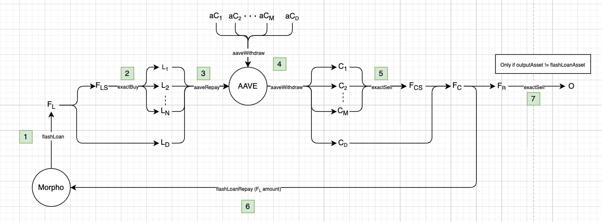

# AAVE Portfolio Wind Down 

The [AAVE Portfolio Wind Down Subbundle](../../subbundles/aaveV3PortfolioWindDownSubbundle.ts) winds down a percentage of a users total AAVE portfolio, leaving the value in general adapter 1 in the required output assets. 

## Flow Diagram

## Defenitions

* $F_L$: Quoted flash loan assets
* $F_{LS}$: Quoted input amount required for exact inputs swaps to loan assets $L_i$
* $L_i$: Loan assets of the users position, excluding their loan in the flash loan asset ($N$ is the number of these)
* $L_D$: Loan assets of the users position in the flash loan asset (D => direct) 
* $aC_i$: aTokens for the users collateral assets
* $C_i$: Collateral assets of the users position, excluding their collateral in the flash loan asset ($M$ is the number of these)
* $F_{CS}$: Quoted output amount for the exact output swap from $C_i$ 
* $C_D$: Collateral assets of the users position in the flash loan asset (D => direct) 
* $F_C$: Total amount of collateral after it is fully converted to the loan assets
* $F_R$: Total amount of collateral in the flash loan asset after repaying the flash loan
* $O$: Quoted output amount in the output asset from the exact sell of $F_R$

Note the following relationships:
* $F_L = F_{LS} + L_D$
* $F_C = F_{CS} + C_D$
* $F_R = F_C - F_L$

## Flow
1. Take a flash loan of amount $F_L$
2. Perform swaps from $F_LS$ to loan assets $L_i$
3. Repay all AAVE loans
4. Redeem aToken to withdraw AAVE collateral
5. Swap collateral assets $L_i$ to the flash loan asset
6. Repay the flash loan
7. Swap remaining value for the desired output asset

## Swaps

There are 3 total swap layers:
1. Flash loan asset to loan assets(`exactBuy`): $F_{LS} \to L$, where $L = \sum_i^N{L_i}$
2. Collateral assets to flash loan asset (`exactSell`): $C \to F_{CS}$, where $C = \sum_i^M{C_i}$
3. Output swap (`exactSell`): $F_R \to O$

> Note: layers 1 and 2 can be composed of many parallel swaps, so $F_{LS}$ and $F_{CS}$ are the sum over all the respective swap quotes.

## Slippage

We want to enforce slippage on the users quoted output amount $O$. Notice there are 3 swap layers, but each is of a different value. Thus, doing typical distribution among sequential swaps like DEX aggregators generally do does not work.

More definitions:
* $S_T$: User defined slippage tolerance based on the quoted output amount
* $S$: Slippage tolerance to apply per swap, this is what we want to find such that $S_T$ is respected

Formalizing the constraint to enforce: 
$$minO = \frac{O}{1 + S_T}$$

Looking at the swap slippage for each swap layer:
1. $$maxF_{LS} = F_LS * (1 + S) \implies maxF_L = maxF_{LS} + L_D$$
2. $$minxF_{CS} = \frac{F_CS}{1 + S} \implies minF_CS = minF_{CS} + C_D$$

Then we can define: $minF_R = minF_C - maxF_L$

And we can linearly scale the quote amount $O$ to account for this minimum input to find:

3. $$minO = \frac{minF_R * O}{F_R * (1+S)}$$

Note that in the case where no output swap is needed (output asset is the same as flash loan asset, or there is no loan positions so we can force this):
* $O = F_R$
* $minO = minF_R = \frac{F_R}{1 + S_T}$
* We can ignore equation 3

Given these, we can solve for $S$, or more simply $x = S + 1$:

We end up with a typical quadatic equation which can easily be solved: 

$$Ax^2 + Bx + C = 0$$

In the case of having the output swap:
* $A = \frac{F_R}{1+S_T} + F_{LS}$ 
* $B = L_D - C_D$
* $C = -F_CS$

In the case of no output swap:
* $A = F_{LS}$
* $B = \frac{F_R}{1+S_T} + L_D - C_D$
* $C = -F_CS$

This can easily solved for $x$ and thus $S$:
* If $A = 0 \implies S = -\frac{C}{B} - 1$
* Else $S = \frac{-B + \sqrt{B^2 - 4AC}}{2A} - 1$

> Note: It's actually possible that $S > S_T$, which can occur when the total liqudity is dominated by loan or collateral assets in the flash loan asset. We clamp $S$ at $S_T$ in implementation to prevent unnecessary slippage.  

## Liquidity Limitations

The available flash loan liquidity limits the total size of loans which can be repaid $F_{LS}$, and thus limiting the size of the portfolio migration. The subbundle only uses a single flash loan asset, and for this reason it is recomended to use the most liquid asset inside Morpho. It would be possible to modify this to include multiple flash loan assets, but it makes the swap routing more complex.

There is also limitations imposed by swap liquidity (price impact, and slippage).
